Hi\~，我是三金。

最近 Qoder 又更新了，UI 上长得和 Codex 非常相似，还有一个小黄鸭的桌宠，但是这个设计就不好评价了。

不过 Qoder 倒是给出了自定义的方法——使用 Petdex CLI。

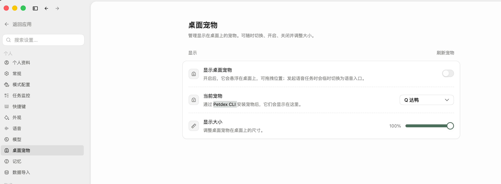

我看了下 Petdex CLI 也支持 Claude Code\Codex\OpenCode 这些，而且资料库很丰富：

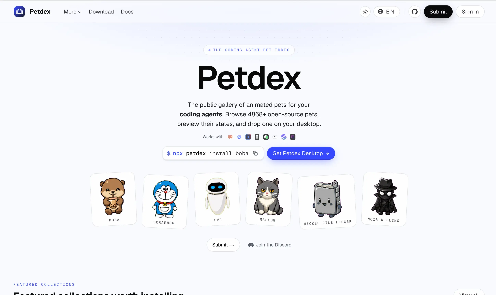

不过它不支持自定义提示音，同类产品上，clawd-on-desk 看起来更满足我的需求，且同样支持 qoder 这些：

从「设置-Agent 管理」来看，它支持的工具还挺全面。

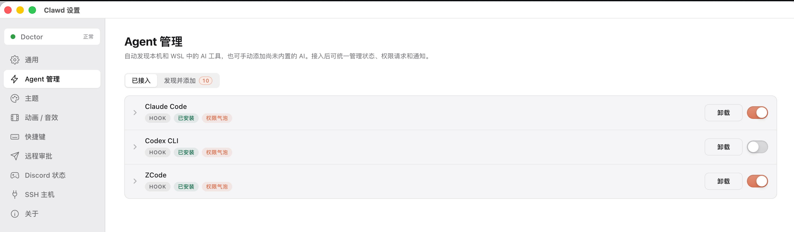

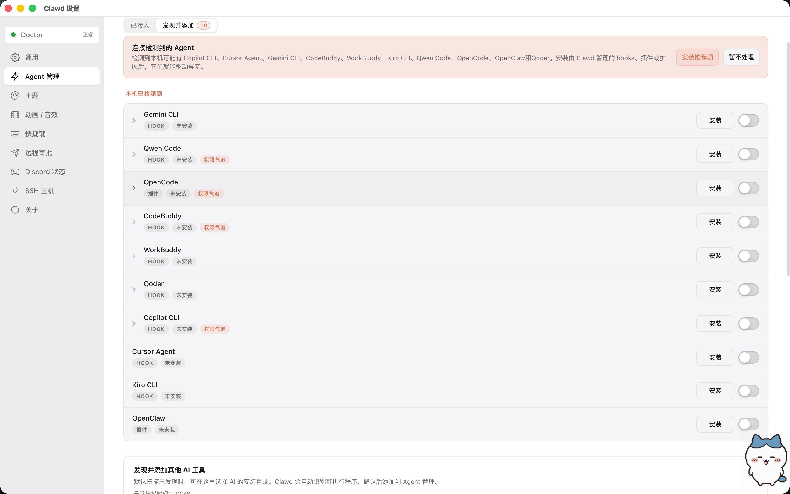

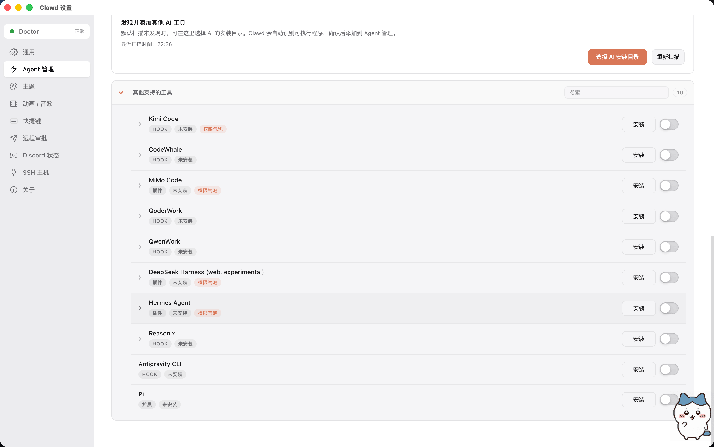

它的 Github 现在已经有 6.2k star 了，地址为：https://github.com/rullerzhou-afk/clawd-on-desk。

可以从 Github Releases 页下载使用：https://github.com/rullerzhou-afk/clawd-on-desk/releases

打开之后我们可以先参考上图中的内容，设置需要关联的 Agent，比如 Claude Code、Codex 等等。

设置好之后，再到主题页面，选择自己心仪的宠物形象，Clawd-on-desk 内置了四个桌宠：

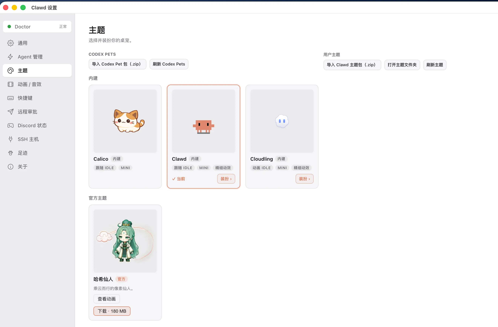

如果你都不满意，可以导入 Codex Pet 包或者 Clawd 主题包。

Codex Pet 包可以在 openpets 上进行下载：

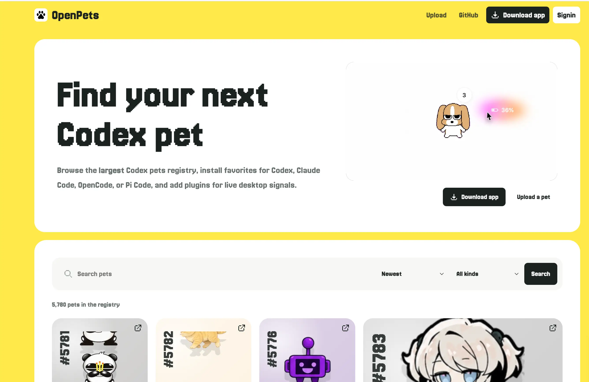

可以有目标地进行搜索，也可以在这些宠物列表中选一款自己喜欢的。我们以小八为例：

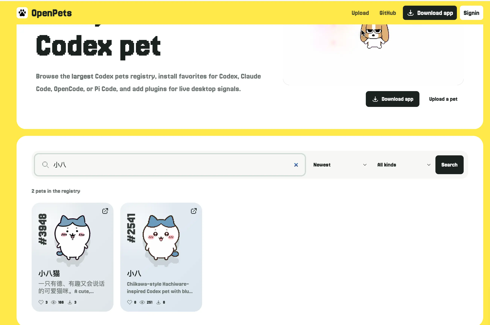

点击进入详情页面：

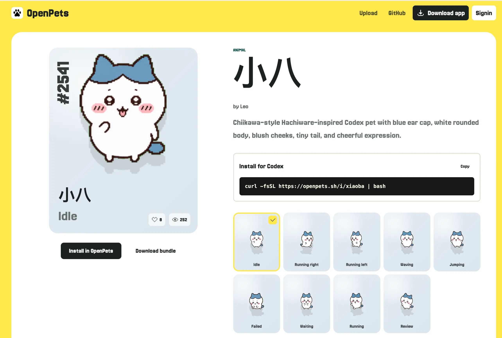

点击 「Download bundle」下载 zip 包，然后回到 Clawd 客户端中，选择「主题-导入 Codex Pet 包」：

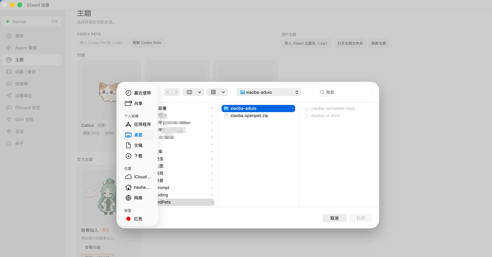

然后就有一个可爱的小八出现在桌面右下角了：

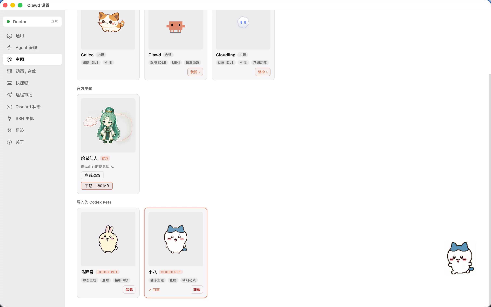

那光有小八怎么能没有小八专属语音提示呢，我们再选择「动画/音效-声音」，下载自己喜欢的音频文件替换掉「完成提示」和「权限提示」：

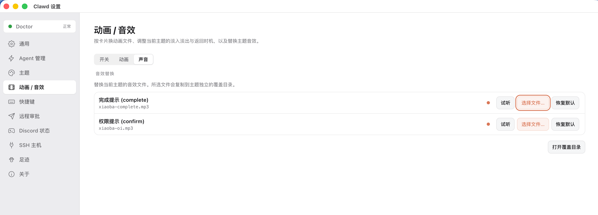

一个专属的 AI 提示桌宠就替换完成啦～
