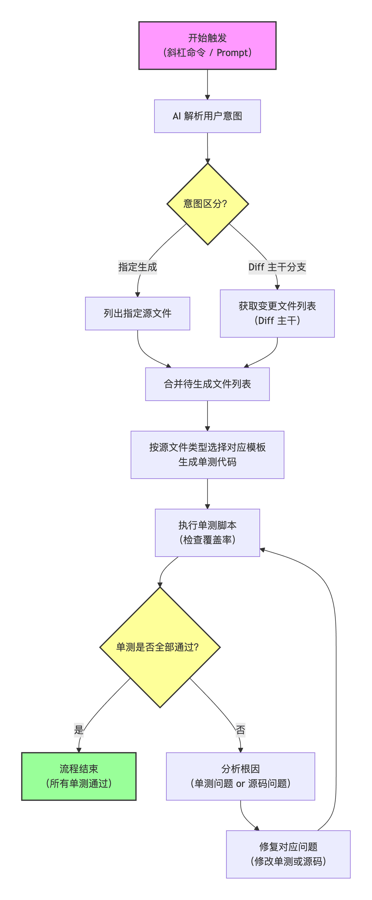

Hi\~，我是三金。

最初始给团队做 AI 单测输出时，还没有 Skill 的概念，所以当时只是建了一个 Command，通过 prompt 来实现单测输出。

前期使用时感觉产出效率一下子就提很高，也能自检自纠，但后面发现有大坑：

* 单测质量完全和模型挂钩，使用比较拉垮的模型，完全就是“自我感动”，为了覆盖率而写的“伪装”代码
* 因为没有强约束，导致生成的单测风格也不一致。五花八门的写法层出不穷
* 和项目单元测试框架配置不统一，没有遵循测试框架配置

在 Skill 出来之后，有计划将单测 Command 迁移到 Skill 上。为了能有效解决上述问题，初始的思路是：

* 制定双角色系统，一个负责生成，一个负责验证，确保测试质量
* 制定规则约束，遵循统一风格
* 通过脚本和配置，自动识别当前项目的单测框架、变更文件，并读取对应配置。最后将配置信息合并到规则约束中
* 借鉴三元大佬的 code-review-expert Skill，在架构层面也做了四层划分：Configuration、Execution Logic、Knowledge Base 和 External Integrations。

在规则约束上，团队内的另一位大佬也分享了他对这块的一些想法：从架构层面抽象出几个不同类型的模块，然后为每一个模块定制一份单测模板。至此，第一版的单测 Skill 就诞生了，目录结构如下：

* SKILL.md
* scripts：存放脚本，获取 diff 等，节省 token 和降低 AI 幻觉
* references：AI 回归测试，用来存放单测检查单，提高单测质量
* templates：存放团队单测模板
* stages: 存放工作流步骤

流程上，大家也可以做个参考：

Skill 具体内容无法分享，不过大致上也就是以下几点（不够大家在评论区补）：

1. **正常路径（Happy Path）**：使用典型的、合法的输入（props、初始 state、context）验证组件能正确渲染主要 UI 内容，且主要业务流程（如提交表单、加载数据）能够顺利执行并产生预期结果。这类 Case 的关注点就是验证核心功能是否可用，不发生崩溃或报错。
2. **边界值（Boundary Values）**：针对数据范围的临界点进行测试，例如空数组、单元素数组、最大/最小数值、分页的首尾页、字符串长度极限等。这类 Case 主要就是为了解决一些极端问题或者说是一些比较容易忽略的问题，我们以为不会发生，但确实有可能发生。它的关注点就是循环、列表渲染、分页控件、数值计算等逻辑在极限输入下的表现，避免出现数组越界、除以零、无限循环等问题。
3. **异常与负面场景（Negative Scenarios）**：模拟错误情况，如 API 请求失败、组件接收无效 props、子组件抛出错误、用户操作触发异常等。这类 Case 的关注点就是组件能否优雅降级（显示错误反馈、fallback UI），是否正确捕获或抛出错误，以及错误边界是否按预期工作。
4. **空值与零值（Null / Empty / Undefined）**：针对可能为 \`null\`、\`undefined\`、空字符串、空对象或空集合的输入，确保组件不会崩溃，并能展示合理的占位内容或默认状态。这是一个很常见同时也很容易出错的 Case，所以它的关注点就是可选 props 缺失时的安全性，以及防御性代码（如可选链 \`?.\`、默认值）是否正确运作。
5. **分支与条件覆盖（Branch Coverage）**：确保组件内所有条件语句（\`if\`/\`else\`、\`switch\`/\`case\`、三元运算符、逻辑 \`&&\` 短路）的每个分支都至少被执行一次。这类问题也很常见，有时候甚至会有一些非常低级错误，所以它的关注点在于不同角色/权限下的渲染差异、登录/登出状态切换、功能开关（feature flags）等分支逻辑的正确性。
6. **状态变更与交互验证（State & Interaction）**：模拟用户真实操作（点击、输入、滚动、聚焦/失焦等），验证组件内部 state 或外部 store 的更新，以及传递给子组件的回调函数是否被正确调用（调用次数、传递参数）。这类其实我是准备直接做到 E2E 里去的，但最终还是加上了，在前端组件中，这是避免不了的单测。它的关注点在于事件处理器副作用（如发起请求、更新缓存）、\`useEffect\` 依赖变化时的响应、清理函数执行，以及自定义 Hook 的逻辑正确性。

在投入使用过一段时间后，也暴露了多个问题， 比较严重的两个：耗时 + 费 token。

为此我又迭代了几版，优化后的版本：

* 在单测生成上可以多 Agent 并行执行加速生成，比原始版本快了 46.2%。
* 在成本优化上，使用脚本做内容过滤，减少上下文消耗；并显式触发缓存机制，费用成本平均降低了 73.3%。

对于 AI 项目工程化来说，方法论都大差不差，唯独在细节上会存在一些差异，比如技术栈不同、架构不同、业务不同等造成的差异。我们可以因地制宜，在一些成熟工具的基础上做一些“本地化”改动，即可快速搭建出一套适合业务需要的 AI 体系出来。
