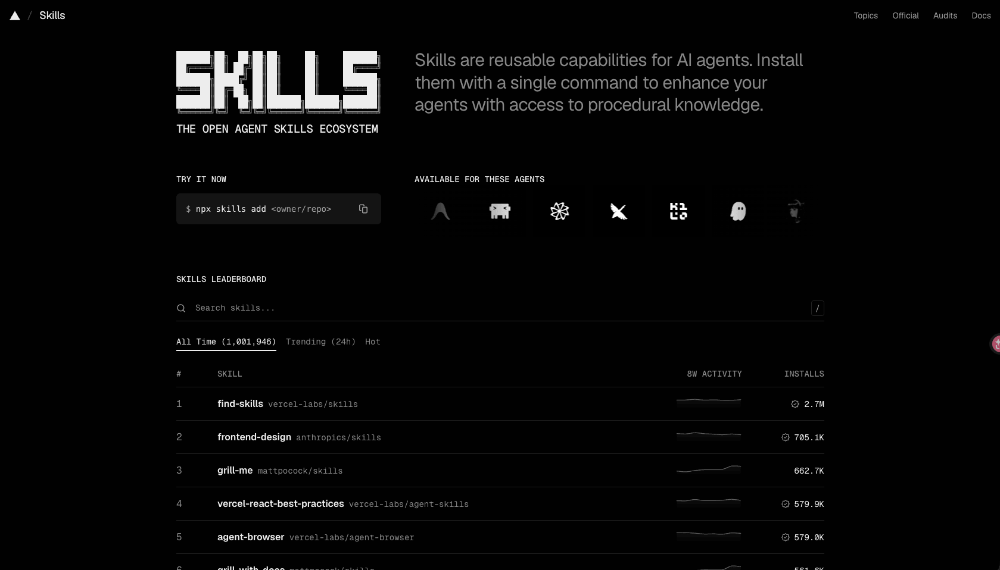
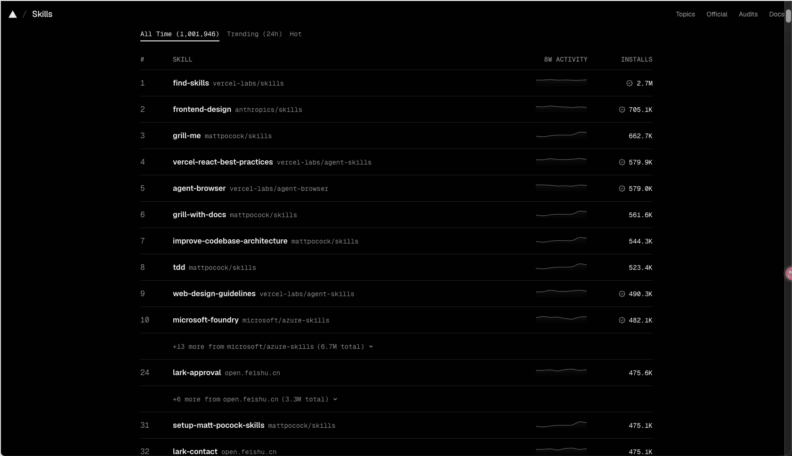
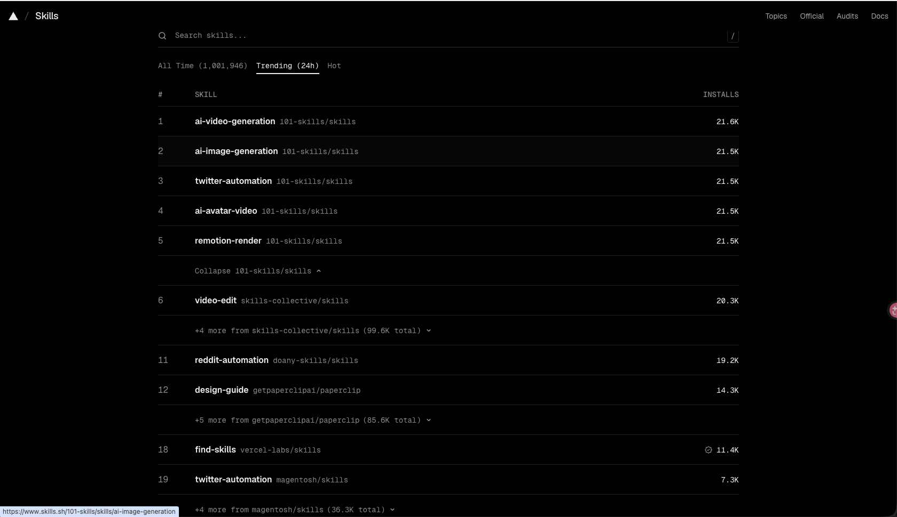
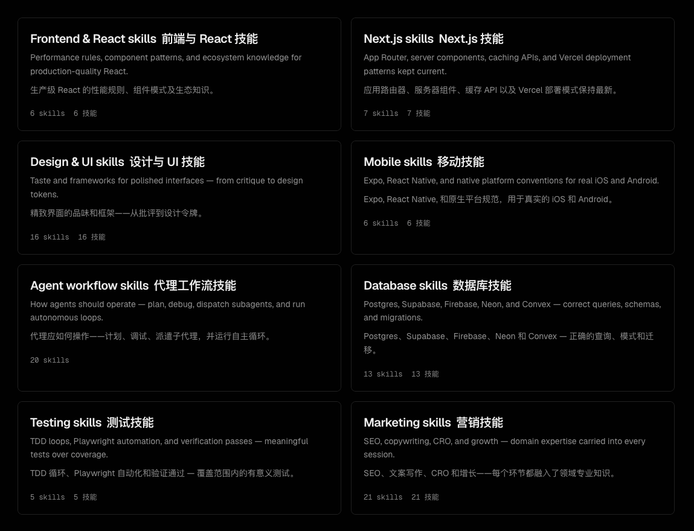
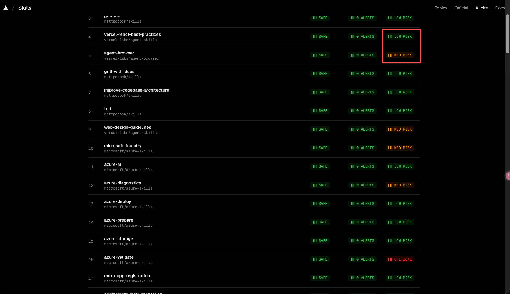
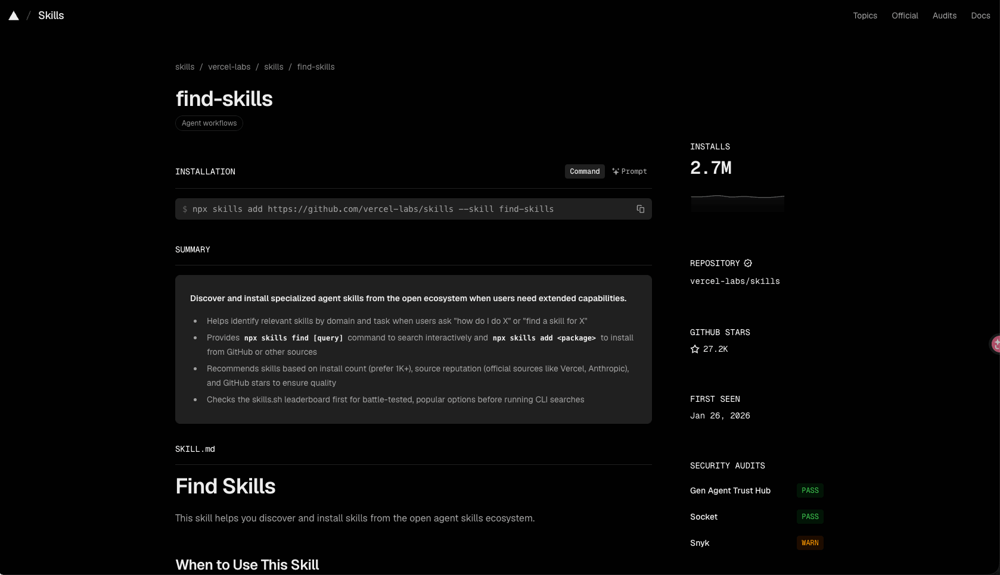

其实 skills.sh 是在今年的 1 月份就上线了，很多玩儿 AI 的小伙伴或多或少也都用过或者听过。这次再拿出来讲是因为它的传播度还没有我想到那么高🤔，身边的朋友和同事竟然还有不知道的，所以这篇文章**算是一个小的分享**。

skill.sh 网站，我们可以把它看成是一个 AI Agent 的技能商店，上面已经有超过 60W 个由社区和官方发布的技能包。我们在上面可以找到包括但不限于编码、办公、科研、游戏等种类的热门 skill。

网址：https://skills.sh

首页展示的是一个排行榜，这个排行榜是根据 skill 的下载量进行排名的。

前十的 skill 中，有四个 skill 都是由 Matt Pocock 贡献的，他是一位非常牛的 TypeScript 专家，曾就职于 Vercel 公司，像排行榜中的 grill-me、grill-with-docs 以及 tdd 等非常火的 skill 都出自他的 **`mattpocock/skills`****&#x20;。这个仓库的 Star 数已经高达 189k。首次 commit 是 2 月份，短短 6 个月，Star 就到 189k，恐怖如斯！**

除了这个总排行榜外，我们还可以看 24h 的热门趋势：

在网站右上角，Vercel 还做了一些导航，分别是：

* Topics：其实就是分类，目前有八种。

* Official：顾名思义，这里列举了都有哪些官方下场提供了他们的 skill.
* Audits：安全审计。汇总了来自 Gen Agent Trust Hub、Socket 和 Snyk 的安全审计结果。让用户知道这个 skill 是否存在中危或者高危风险。

* Docs：这里面介绍了网站数据来源，排行榜如何生成的，以及 skill 如何安装。

我们可以选中一个 skill（以 `find-skill` 为例），进入详情中查看这个 skill 的详细信息。

里面包括：

* 如何安装，比如 `npx skills add <skill-name>`
* 技能摘要：技能的简要说明，一般放在 description 中。
* 告诉用户如何触发这个技能。

`find-skill` 是一个非常好用的查看技能的技能，大家如果有一些继续需求，可以直接使用该技能来进行查找和安装，非常 nice\~

