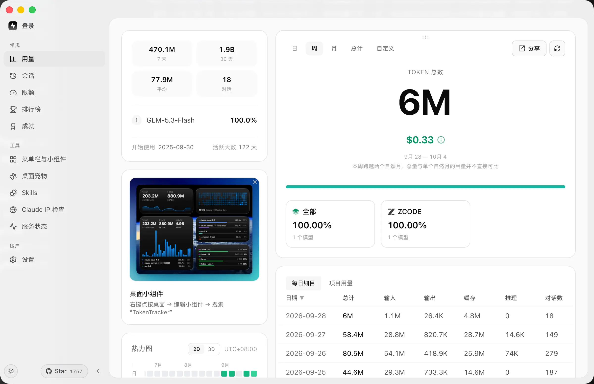
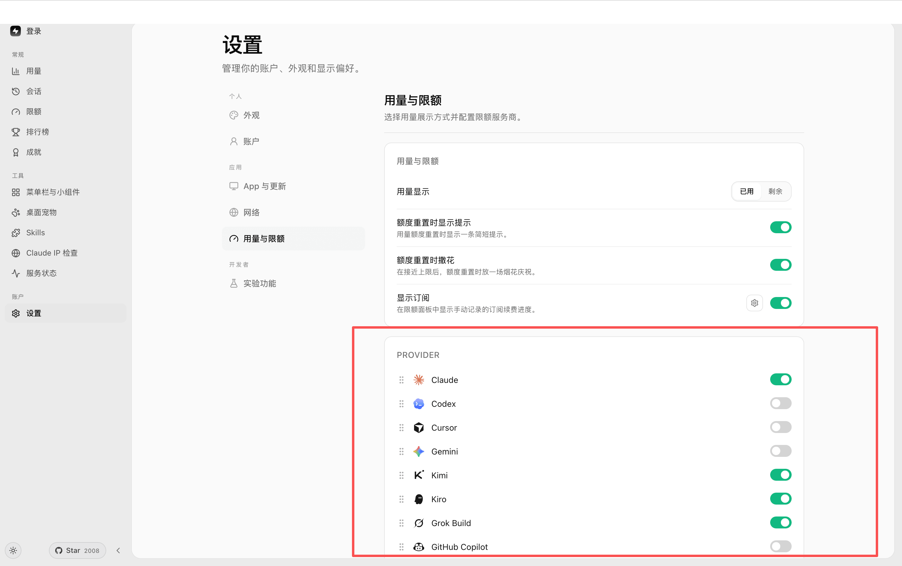
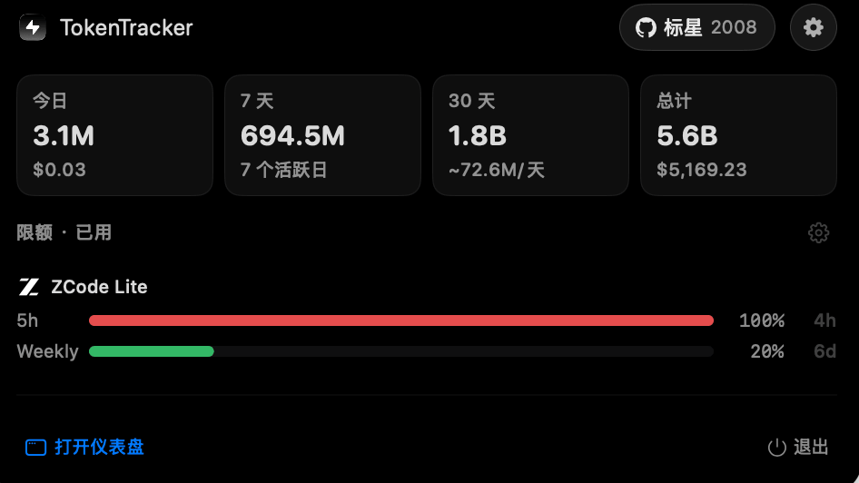
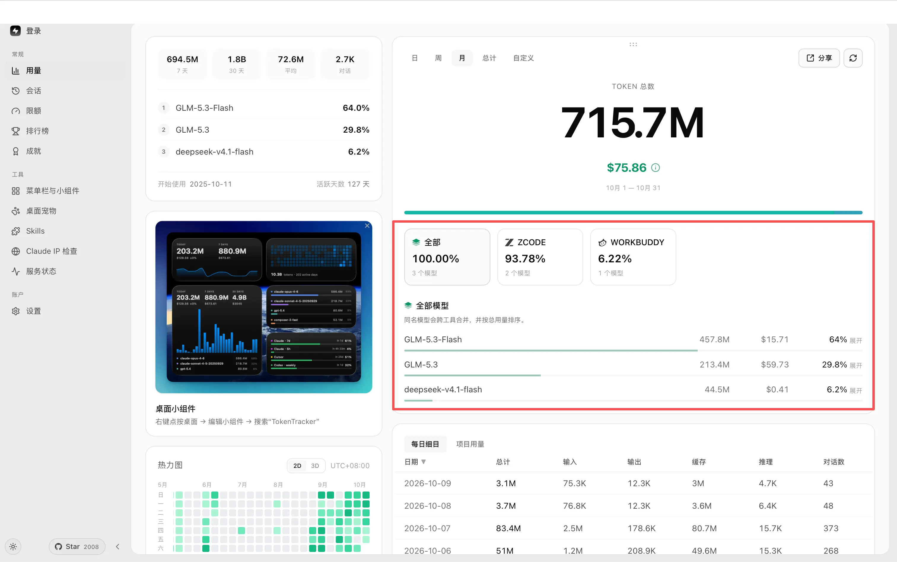
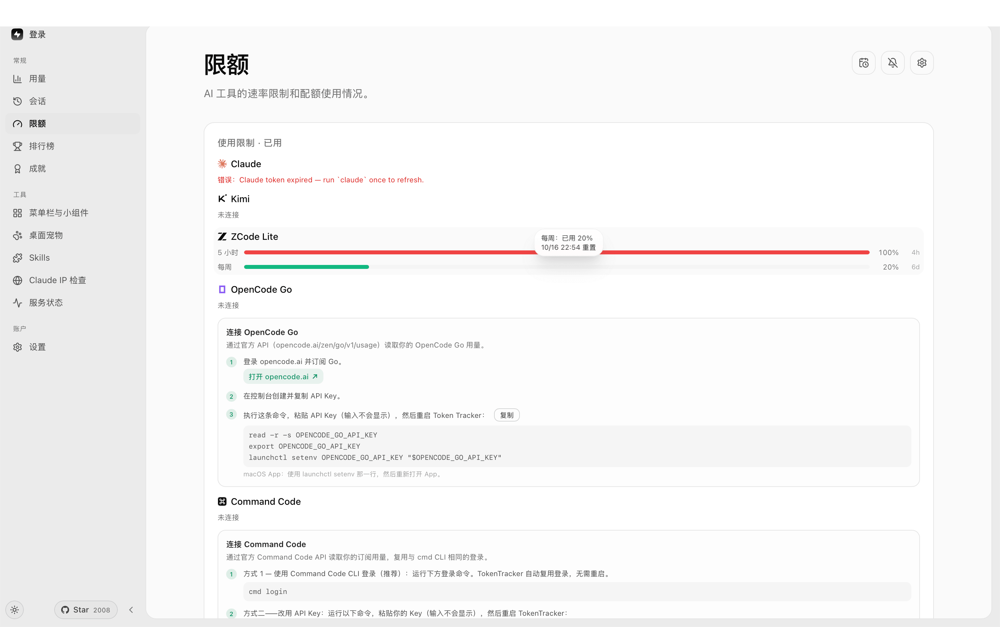
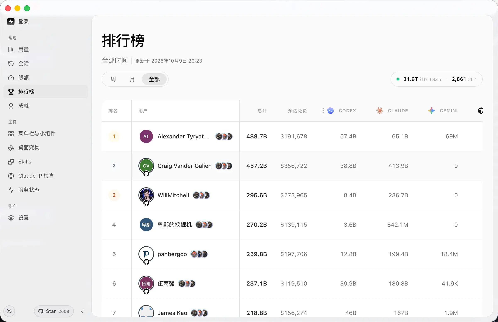
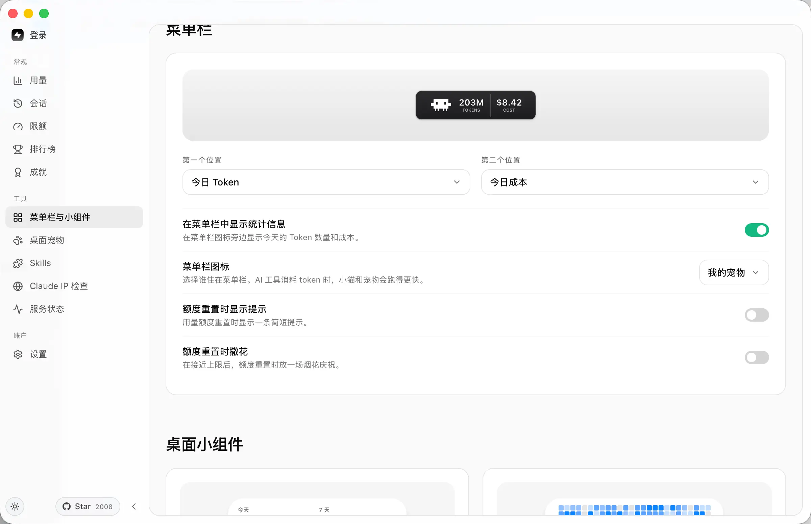
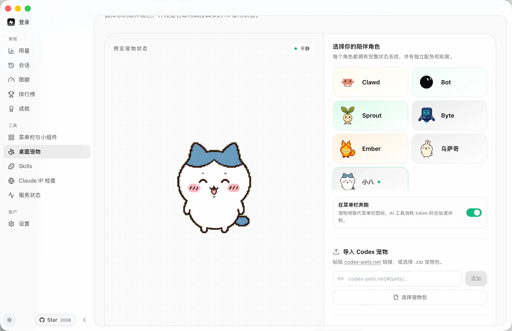

Hi\~大家好，我是三金。

最近各大模型厂商或多或少都在做一些限免以及领鸡蛋活动，比如：

* WorkBuddy 的 Hy4 preview 从 9 月 11 到 10 月 30 号夜间免费，Hy3 限免到 10 月 30 号；
* Qoder 最近每天登录能领 100 Credits，以及 Qwen 3.8-Flash 限免；
* 国际版 Trae 首次注册会有 7 天试用等等

使得我现在的 AI 工具越来越多，付费的也有，免费的也有，这对于 Token 使用量的监控来说很不友好。所幸在 Github 上有一个开源 Token 监控程序—— TokenTracker：

> 它可以自动采集 **41 款 AI 编码工具** 的 token 用量，全程本地聚合，用一套漂亮的 Dashboard 看真实成本与趋势。不需要云账号、不需要 API Key、不需要任何配置 —— 一条命令搞定。

支持但不限于：Claude Code、Codex、Cursor、OpenCode、CodeBuddy\WorkBuddy 以及 Qoder 等 41 款 AI 工具。

## 安装

可以通过访问官方网站进行安装：https://www.tokentracker.cc/

对于 Linux 用户来说，可以通过 Github Release 下载对应的安装包：https://github.com/xiufengsun/TokenTracker/releases

## 设置及使用

设置这块我只在用量与限额这里打开和关闭了几个 PROVIDER

比如 Claude\Kimi\Kiro\ZCode\Qoder 等等。

然后在可以选择打开额度重置的提示以及显示订阅，比如我这边会展示 ZCode 的订阅：

在仪表盘的用量页面，你也可以看到你今天用过的所有模型以及 token 消耗：

对于限额来说，是需要你登录账号的，不然应用自身也没法进行获取：

它也支持登录，登录后可以在排行榜页面看到你自己的排名。当然不登录也可以看其他人的排名

它还内置了一些小工具，比如在菜单栏这块可以设置「显示统计信息」，以及桌面宠物：

不过我相信，使用这个程序的小伙伴，最看重的还是它的 token 统计能力，这些都是一些附带的交互体验。每隔一段时间我们在 TokenTracker 上可以看看到底用了多少 token 以及燃烧了多少经费，能更高效的进行成本优化。
