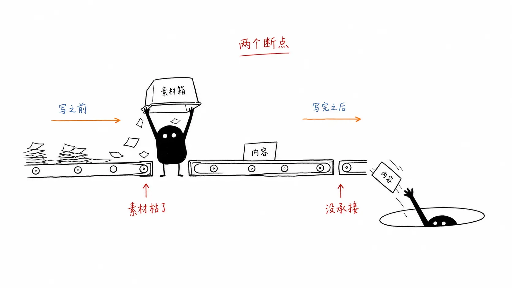
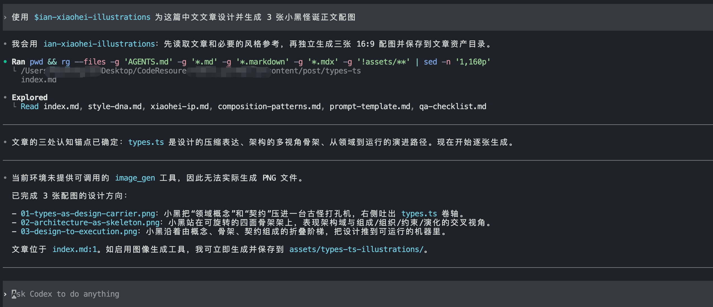
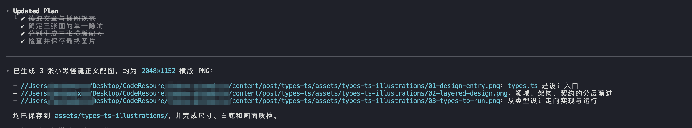
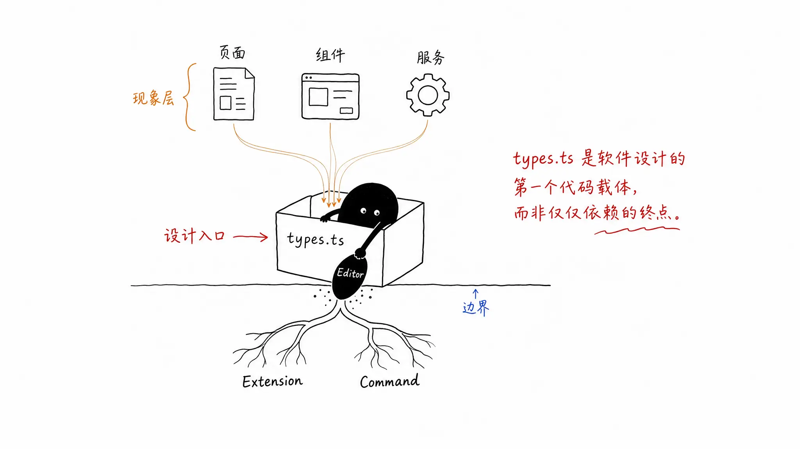
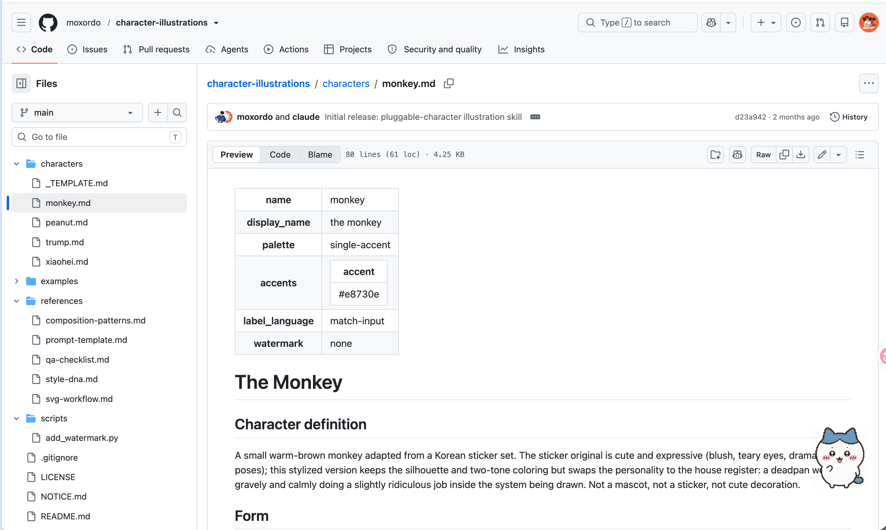
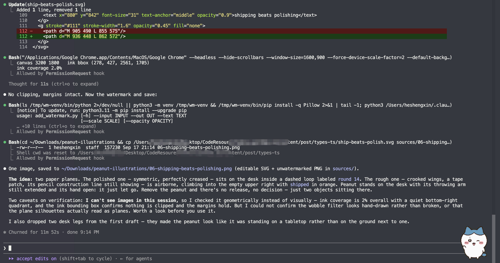
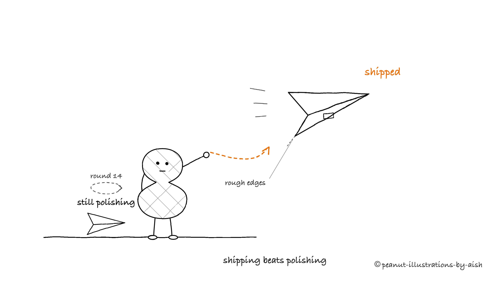

H～，我是三金。

离上次发文将近一个月了，这一个月，三金的好多同事搭子都遭受到了裁神的光顾。搭子被裁，让人一度产生戒断反应，工作量也倍增，经常熬到一点多还在 commit 代码🤷‍♀️。

繁忙的工作，基本占据我了所有的精力，不过也不是没有收获，倒是积攒了一些素材，有：

* UI 自动化测试 - 个人版
* 文章配图
* 其他

UI 自动化已经出过两篇了，今天先穿插介绍一个文章配图的 Skill。

想来大多数搞文章自媒体的朋友，大都被"配图"这件事折磨过：

*你让 AI 配图，它要么甩给你一张和正文毫无关系的装饰画——蓝天白云、握手、齿轮、发光大脑；要么生成一张一眼假的 AI 插画，高糊不说，还跟文章内容毫无关系。读者划过去，什么也没多记住。*

最近我在调研文章插图类的 Agent Skill，碰到了两个很有意思的项目，一个炙手可热但门槛不低，一个冷门但恰好补上了门槛。这篇文章会把两者都讲清楚，并手把手介绍后者(平替)在 Claude Code 里的安装和使用。

***

## 一、Codex 专属技能：ian-xiaohei-illustrations

这是一个 Github star 数高达 11.7k 的正文配图生成 Skill。

它的核心目标就是通过理解文章里的认知锚点，然后把其中的一个判断、流程、结构、状态或隐喻等，转换成一张有记忆点的 16:9 的手绘解释图。

在手绘解释图中，默认会使用「小黑」——一个黑色实心、白点眼、细腿、空表情的卡通角色来做流程的参与者。



它的仓库地址是：[helloianneo/ian-xiaohei-illustrations](https://github.com/helloianneo/ian-xiaohei-illustrations)，我们可以通过以下方式来进行技能安装：

```shellscript
# 克隆仓库
git clone https://github.com/helloianneo/ian-xiaohei-illustrations.git
cd ian-xiaohei-illustrations

# 复制技能
mkdir -p "${CODEX_HOME:-$HOME/.codex}/skills"
sk "${CODEX_HOME:-$HOME/.codex}/skills/"
```

然后重启 codex 之后，就可以使用了。

> ⚠️注意，这里需要正儿八经登录了 Codex 的用户或者支持 gpt-image-2-high 模型时才能使用，因为这个技能主要使用 **`image_gen`****&#x20;**&#x6765;生成图片。



正常情况下，它是这样的：

```shellscript
使用 $ian-xiaohei-illustrations 为这篇中文文章设计并生成 3 张小黑怪诞正文配图。
```



`01-design-entry.png`：



整个 Skill 从正文到成图的完整流水线如下：

1. 读取文章、Markdown、Notion 内容或用户给的主题
2. 提炼核心观点、认知转折、流程结构
3. 先输出 shot list(每张图只选一个认知锚点,默认 4-8 张,上限 9 张)
4. 为每张图选择结构类型：Workflow、前后对比、角色状态、概念隐喻、方法分层……
5. 重新发明一个低科技、怪诞但成立的物理隐喻
6. 让小黑承担核心动作
7. **每张图单独调用图像工具生成**
8. 按 QA checklist 检查:白底、留白、小黑动作、中文标注、非 PPT 感
9. 保存最终 PNG

那它能直接在别的 AI Agent 中使用吗？比如 Claude Code? OpenCode？

答案是不能，因为在这个 Skill 中有这样一句：

> 如果用户明确要求"生成 / 输出 / 做图 / 帮我生成"，不要停下来等确认；**用内置&#x20;****`image_gen`****&#x20;每张单独生成**。

`image_gen` 是 OpenAI Codex 环境内置的图像生成工具，Claude Code 里并没有这个工具。所以哪怕咱们把这个 Skill 原模原样拷进 `~/.claude/skills/`，Claude 读完了全部风格规范、构图方法论、QA 清单，它还是无法出图。

***

## 二、魔改版：character-illustrations

如果你既没有官方 Codex 也没有生图 API，怎么办呢？

别怕，我的朋友，这里为你在 GitHub 上找到了一个平替：[character-illustrations](https://github.com/moxordo/character-illustrations)。

它 2026 年 7 月才创建，目前还非常冷门，只有一个 1 个 star。但它的思路相当扎实——作者直接魔改了 ian-xiaohei-illustrations，把它从「Codex 专属」改造成了 AI Agent 通用。

README 里交代得很清楚：原版 skill 的架构——风格 DNA、构图模式、prompt 模板、QA 清单、小黑角色全部保留作为地基，在此之上还做了三个关键改造。

#### 1. 可插拔的角色系统

在原版的 Skill 中，小黑这个 IP 是硬编码的。而这个版本里，把角色改造成了可插拔的输入。

每个角色都存放在 `characters/` 目录下，以 Markdown 的文件形式呈现，文件内容里自带外形、性格、动作库、色板、SVG 画法和图像生成 prompt。内置了四个角色，除了已知的小黑外，还有 monkey\peanut\trump。

除此之外，你还可以自造角色：通过 prompt 来描述你想要的角色，Skill 会自动套用 `characters/_TEMPLATE.md` 模板补全整份文件并保存，下次直接复用。



#### 2. 本地 SVG 渲染

这是解决 `image_gen` 依赖的核心方案。

Skill 不再调用图像生成模型，而是通过 AI 来写 SVG：用 `feTurbulence + feDisplacementMap` 滤镜制造手绘抖动感，用系统手写字体写标注，然后用本机安装的 Chrome 把 SVG 渲染成 3200×1800 的高清 PNG。

这个方案有三个实打实的好处:

* **中文标注零错字**。用图像模型生成时中文错字是重灾区，SVG 方案的文字是直接写进代码的，一个字都不会错。
* **源文件可编辑**。改个标签、挪个位置，编辑 SVG 重新渲染即可，迭代是确定性的。
* **不依赖任何图像生成服务**。没有 API key、没有配额、没有费用，本地跑通。

原版的 image-gen prompt 模板也保留了下来，作为可选后端——仅当环境里真的有图像生成工具时才启用。

#### 3. Persona 机制

角色的 profile 可以带一个可选的“语气与做派”段落：标签的口吻、口头禅(每图最多一句)、标志性手势、舞台习惯。

***

#### 安装

前置条件：一个可用的 AI Agent，比如 Claude Code；Git 用来下载 Skill 仓库；Google Chrome 用来做 SVG 的渲染；Pillow 是可选工具，只有想给图片加水印时才需要。

```shellscript
git clone https://github.com/moxordo/character-illustrations.git ~/.claude/skills/character-illustrations
```

#### 验证

开一个新的 Claude Code 会话，直接问一句:

```shellscript
用 peanut 画一张 "shipping beats polishing" 的概念图
```





#### 在文章中的实践

我主要会在一些文章中使用这个 Skill，一般遵循先规划后生成的原则。比如：

```shellscript
/character-illustrations 先不要生图。
请分析 xxx 文章哪里值得配图，输出 5 张左右的 shot list。
每张图写清楚：放在哪段后、主题、核心意思、结构类型、小黑在做什么、建议中文标注词。
```

如果你对某张图的效果不满意，也可以进行修改：

```shellscript
/character-illustrations 帮我编辑这张图，去掉左上角的“流程图”标题，其他内容保持不变。
```

character-illustrations 的产物一般会存在 \~/Downloads/<角色名>-illustrations/ 中，每个角色共享一个目录，跨批次连续编号，这和正版小黑的差异很大，ian-xiaohei-illustrations 是将图片直接存在当前工作区。

比如用 peanut 画的就是 `~/Downloads/peanut-illustrations/`。下一批图会先列目录、接着上次的编号往下排,天然形成每个角色的"作品全集"。

我不是很喜欢这种方式，所以修改了一下这里的落库规则，还是依照小黑的做法，直接保存到当前工作区。

顺带一提，这个谱系里还有第三个项目：花生的版权方 [aishwaryaashok14/peanut-illustrations](https://github.com/aishwaryaashok14/peanut-illustrations)，character-illustrations 的花生角色和水印脚本都来自它。

二者不是二选一的关系，普通逻辑关系生图可以使用 character-illustrations 来实现，而遇到复杂逻辑关系时则可以回到 ian-xiaohei-illustrations。
